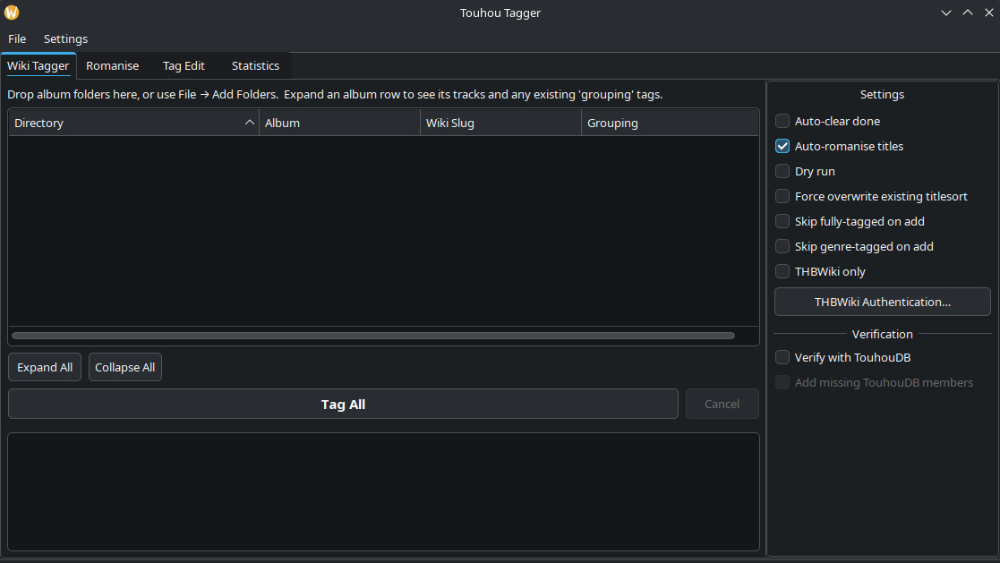

# Touhou Tagger

**Touhou Tagger** is a tool made in Python that helps you tag through your Touhou music, using the data fetched from English [Touhou Wiki](https://en.touhouwiki.net/wiki/Touhou_Wiki), [THBWiki](https://thwiki.cc) and optionally [TouhouDB](https://touhoudb.com).

## Purpose

The primary purpose of the tagger is to match remixes with their themes, so that remixes of specific themes can be found more easily. This is something normal taggers, such as MusicBrainz Picard, don't typically do. It uses `grouping` tags for this, so a player that supports them is necessary (e.g. [Quod Libet](https://github.com/quodlibet/quodlibet)) if you want to see the themes.

In addition to this, it adds other tags to the songs as a bonus, the list of which can be found below under the Requirements section.

## Requirements

- Python 3.10+
- curl
- core Python packages: `beautifulsoup4`, `mutagen`, `curl_cffi` (installed in [Installing](#installing))
- PyQt5 for the GUI (installed in [Installing](#installing); the default `launch.sh` opens the GUI)
- A THBWiki browser cookie — **mandatory for every run** (see [Authentication](docs/AUTHENTICATION.md))

Optional features (English-wiki fetch, romanisation, CUE splitting) need extra
dependencies; for them, check [Installing](#installing) and [DEPENDENCIES.md](docs/DEPENDENCIES.md).

## Features

- fetches the following tags from English Touhou Wiki/THBWiki (optionally TouhouDB):
    - album
    - albumartist (band/circle)
    - albumartistsort (for official romanized names like e.g. "Diao ye zong" over "凋叶棕" when available)
    - arranger
    - artist (when TouhouDB verification is enabled; based on arranger/vocalist credits and optionally extended with TouhouDB data)
    - artistsort (when TouhouDB verification is enabled; official TouhouDB romanisation preferred, with a THBWiki fallback — for officially romanized names like e.g. "Meramipop" instead of "めらみぽっぷ")
    - catalognumber
    - date
    - genre
    - grouping (tag to show Touhou themes; e.g. "Necrofantasia", songs using multiple themes use semi-colons like "Necrofantasia; Spiritual Domination ~ Who done it!")
    - lyricist
    - titlesort (romanized locally)
    - vocalist
    - year
    
- usable with CLI and GUI
- supports MP3, FLAC, Ogg Vorbis, Opus, and M4A
- basic tag editing capability for small, manual fixes for specific tags
- statistics to view details related to your collection
- automatic romanization of Japanese titles (into the `titlesort` tag field, original title fields are left intact), plus a specific romanization tab
- ability to split large .flac files into separate songs using a .cue file; mainly useful if your player doesn't support separate songs using .cue files

## Installing

> **Platform note:** this release targets **Linux** and is only tested there.
> The code has no Linux-specific assumptions and may well run on Windows or
> macOS, but neither is supported yet; the Windows commands below are provided
> as a convenience, not a guarantee. Windows support is planned for later.

Clone the repository or download and extract its source archive, then open a
terminal in the project folder.

### Easy install (recommended)

Run the launcher from a terminal:

```bash
./launch.sh
```

The first time it runs, if the Python dependencies aren't installed yet, it
shows a short menu — **Minimal** (core packages + the GUI, enough to run the
tagger) or **Full** (every optional feature) — lists exactly what each option
installs and why, and after you confirm, installs them into a project-local
`.venv`, leaving your system Python untouched. Afterwards `launch.sh` opens the
GUI directly every time.

If your file manager doesn't run `.sh` files on its own, mark the launcher
executable first (`chmod +x launch.sh`, or right-click it and enable "allow
executing file as program" under its Permissions), and run it from a terminal
for the first-time setup so the install prompts are visible.

CUE-based FLAC splitting additionally needs the system `ffmpeg` and `flac`
tools, which the launcher can't install; it prints the right command for your
distribution, or use the per-distro commands under **Manual installation**.

### Manual installation

If you'd rather set things up yourself, create and activate a virtual
environment (recommended):

```bash
# Linux / macOS
python3 -m venv .venv
source .venv/bin/activate

# Windows PowerShell
py -m venv .venv
.\.venv\Scripts\Activate.ps1
```

Install the core dependencies, plus the GUI and English Touhou Wiki fetcher:

```bash
python -m pip install --upgrade pip
python -m pip install -r requirements.txt -r requirements/gui.txt \
  -r requirements/browser-fetch.txt
python -m playwright install chromium
```

Optional features need additional dependencies:

- Browser-cookie auto-pull:
  `python -m pip install -r requirements/cookie-auto-pull.txt`
- Japanese title romanisation:
  `python -m pip install -r requirements/romanisation.txt`, then
  `python -m unidic download`
- CUE-based FLAC splitting: install FFmpeg and FLAC (including `metaflac`)
  through your operating system's package manager:
  **Fedora:** `sudo dnf install ffmpeg flac` (you may need to install full ffmpeg from the [RPM Fusion](https://rpmfusion.org/) repo)
  **Debian/Ubuntu:** `sudo apt install ffmpeg flac`
  **Arch:** `sudo pacman -S ffmpeg flac`

#### Full installation (all features)

To install every Python feature group at once:

```bash
python -m pip install --upgrade pip
python -m pip install -r requirements/all.txt
python -m playwright install chromium
python -m unidic download
```

CUE-based FLAC splitting additionally needs the system `ffmpeg` and `flac`
tools (see the optional-features note above); everything else is covered by the
commands here.

See [DEPENDENCIES.md](docs/DEPENDENCIES.md) for the supported Python versions,
all dependency groups, a core CLI-only install, and an all-features install.

## Using the tagger

Start the GUI by running `./launch.sh` from a terminal, or by double-clicking it in your file manager once it's marked executable (see [Installing](#installing)). On the very first run it offers to install any missing dependencies; after that it opens the GUI straight away.

For CLI usage, you'll need to `cd` into the tagger directory (e.g. `cd ~/Downloads/"Touhou Tagger/source"`) and use `python touhou_tagger.py` with related flags. The preferred layout for the tagger is `<root>/<artist>/<album>/<tracks>` - see [folder layout](docs/FOLDER_LAYOUT.md) for more info. If using the tagger in the terminal, test with a dry run on a copy or small test album first: `python touhou_tagger.py "Wiki_Page_Slug" "path/to/album" --dry-run`.

Review the output before running without --dry-run. Consider backing up music you care about before bulk tagging, and especially before CUE splitting, which changes the album’s files and, after verification, either moves the original image to Trash or leaves it in place according to your selected preference.

### GUI



1. When you start the tagger, you'll need to add albums to it. Go to your music library and select any album (or an artist folder containing several albums), and drag and drop it into the tagger - you can also add them in from File -> Add folders option in the top-left. This should show the album within the tagger: showing its directory, album name, wiki slug and grouping tags if the album is expanded. Untagged albums probably won't have grouping tags yet, so that being empty is normal.

2. Next, you'll need to authenticate to use THBWiki - it is necessary for the tagger to work, as it contains _vastly_ more information than the English wiki does, with only occasional albums being present in the English wiki while missing from THBWiki. Go to https://thwiki.cc and click through the challenge screen, so that you're in the wiki's main page. After that, hit **F12** on your keyboard to open the "DevTools" (on Chromium-based browsers, basically anything not-Firefox) and **go to the "Network" tab, then reload the page**. Scroll up the list and click the top-most item, then scroll down the "Headers" tab - you should see a row with "Cookie". **Copy the entire random-looking string of text into the tagger** - this lets the tagger use the wiki until the cookie expires. After that, add in the user-agent: that'll probably be the lower-most thing on the "Headers" list. Copy and paste the text that says something like "Mozilla/5.0..." etc. to the tagger.

3. After that, keeping "Impersonate" as "chrome" is usually fine, unless you're using Firefox in which case it should be set to "firefox". "Browser source" should be whatever the browser you used to go to THBWiki was. If "Auto-pull" is toggled, it'll automatically try to fetch the required cookie from the browser; it's only stored within the tagger's process environment, it is not saved into the configuration or the logs. You can keep it disabled or even remove the `browser_cookie.py` file altogether if that's a concern. It'll just mean you have to do more manual work to use the tagger.
    - If you're using auto-pull: using the `thwiki_keepalive.user.js` userscript is recommended (installed using e.g. Tampermonkey). THBWiki cookie refreshes every once in a while even without showing a new "are you human" verification, and the userscript simply keeps the wiki page's cookie updated. The tagger works without it, but you'll have to manually refresh the pages for it. After you've done everything, hit Save.
    
4. If you want, enable or disable settings from the right sidebar; if you want to see what it would do first without it actually affecting anything, toggle the "Dry run" setting. After that, hit **Tag All** - the tagger should try to find and tag the album automatically. It'll first cache all required data, in this case just for this album, then it'll tag them. Once it's done that, it'll show a summary screen plus details per track on the other tab. If it **didn't** find the album, you'll need to try and search for it in the wiki(s) yourself, then paste the "wiki slug" to the wiki slug field; e.g. in the URL https://thwiki.cc/Shout_at_The_Devil, that would mean pasting "Shout_at_The_Devil" into the field. Some symbols need manual fixing; e.g. an album with a "&" like [God & Guns](https://thwiki.cc/God_%26_Guns) has the ampersand replaced with "%26" in its URL. In the tagger, the slug needs to look like "God_&_Guns".
    - In some cases, the tagger may find a completely unrelated album that just happens to have the same name. The tagger is able to detect that and stop tagging - it'll pop up a screen, from which you can review what the differences are and either continue tagging as normal, skip the album or cancel the tagging process altogether.

`grouping` (Touhou) themes live within `source/touhou_theme_mapping.json`. With new games and new themes, it can become outdated - you can manually add new themes by following the format in the file (remember to also add the titles into the `normalized_keys` section, otherwise it won't work), or you can wait for me to update the file.
    
### CLI

Use the CLI from the `source/` folder. THBWiki authentication is still required:
set a current Cookie header and the matching User-Agent from a browser that
has completed THBWiki's verification.

```bash
export THWIKI_COOKIE='your full Cookie header'
export THWIKI_UA='the matching User-Agent header'

# Always review a dry run first.
python touhou_tagger.py "Wiki_Page_Slug" "path/to/album" --dry-run

# Remove --dry-run only after reviewing the proposed changes.
python touhou_tagger.py "Wiki_Page_Slug" "path/to/album"
```

Supply additional `Wiki_Page_Slug` / album-folder pairs to process several
albums in one run. Run `python touhou_tagger.py --help` for all options,
including `--thwiki-only`, metadata/credit controls, romanisation controls,
and optional TouhouDB verification.

## Current known limitations

- Statistics treats a track as tagged only when its `grouping` exactly and case-sensitively matches a canonical theme name; hand-edited near-matches appear untagged.
- Certain symbols like & must be entered manually into the wiki slug field.
- Themes are only visible within players that support `grouping` tags.
- Title romanization has flaws: it tries to be as accurate as possible, but Japanese is a very context-dependent language, and it also has no way of knowing what the artist's actual intended reading of the title was.

## Documentation

- [Authentication](docs/AUTHENTICATION.md): THBWiki cookie setup, manual and auto-pull
- [External tools](docs/EXTERNAL_TOOLS.md): FFmpeg, FLAC, MeCab, and other executables
- [Python dependencies](docs/DEPENDENCIES.md): pinned package versions and optional groups
- [Folder layout](docs/FOLDER_LAYOUT.md): supported album/artist directory structures
- [User data](docs/USER_DATA.md): where config and logs are stored, and how cookies are handled (privacy notes)

## Changelog

See [CHANGELOG](CHANGELOG.md).

## Contribution

See [CONTRIBUTING](CONTRIBUTING.md).

## License

MIT. See [LICENSE](LICENSE).
